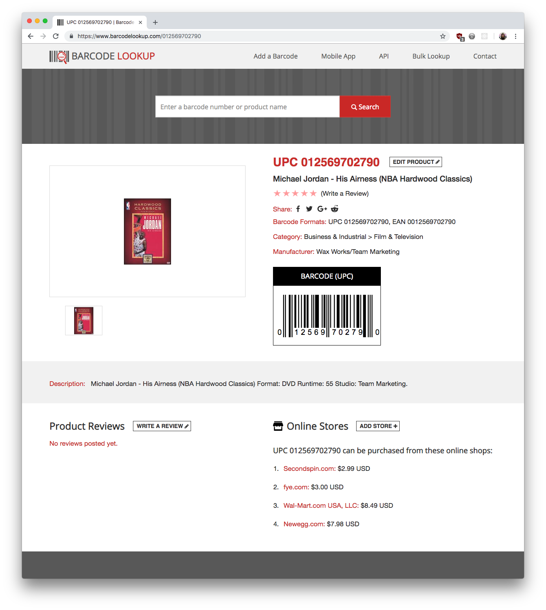
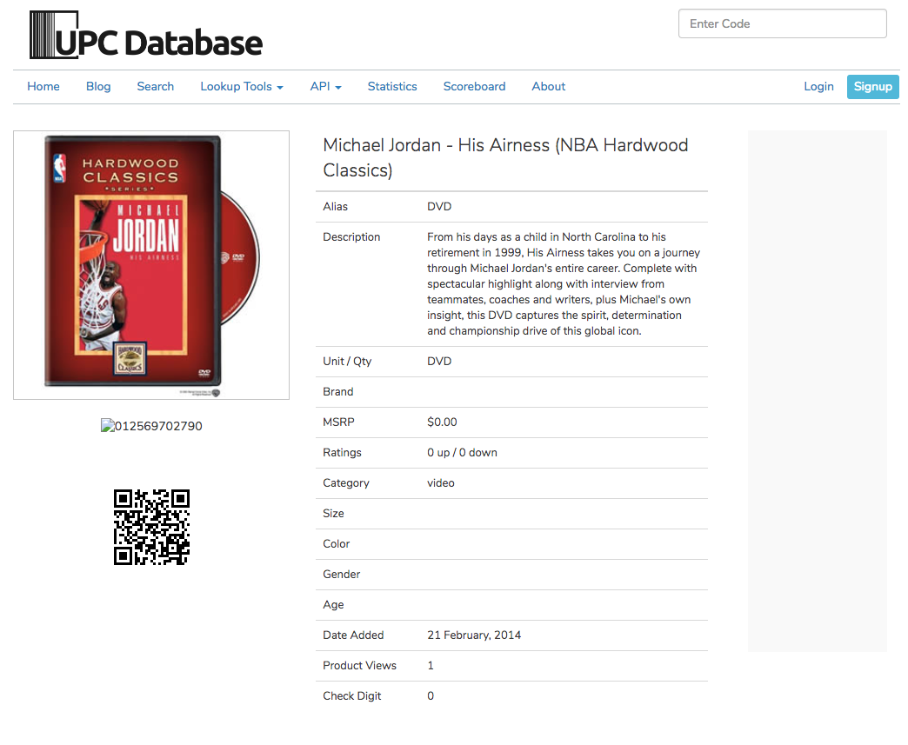

# UPC APIs

Sources of data for products.


## Barcode Lookup



* 5k calls, $99/month
* free test account: 50 free calls

```
https://api.barcodelookup.com/v2/products?barcode=0123456789012&key={key}
```


## UPC Database



* 5k calls, $20 ($0.004/each)
* free plan: 2500 calls

```
https://api.upcdatabase.org/product/:id/:key
```

Note: This API isn't very useful since you can't lookup by UPC.


## UPC Item DB

* 20k calls/day, $99/month
* free plan: 100 calls/day

```
https://api.upcitemdb.com/prod/trial/lookup?upc=786936291568
```


## Walmart Open API

Note: Best option, for the moment.

* 5 calls/second
* 5k calls/day

```
http://api.walmartlabs.com/v1/items?upc=786936291568&apiKey={key}
```


## Semantics3

[apis](https://www.semantics3.com/products/product-data-apis)

Note: Requires a corporate email account for trial.
